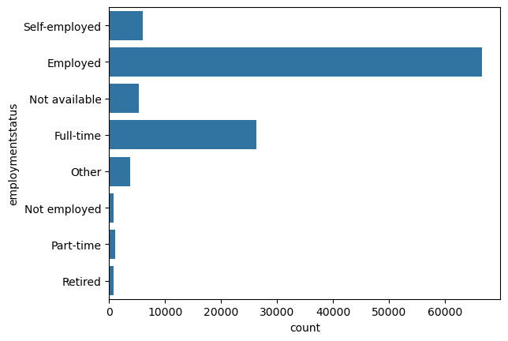
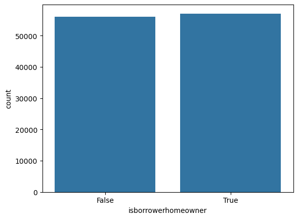
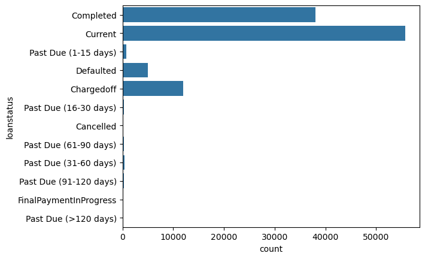
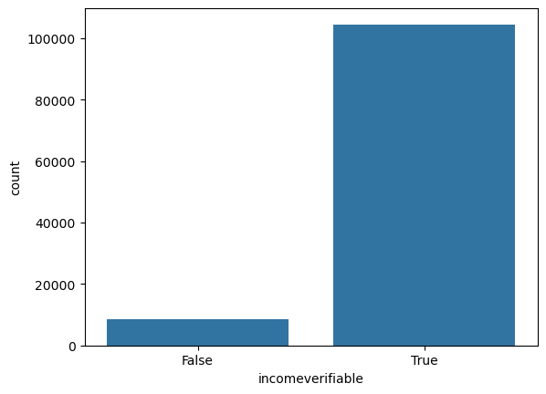
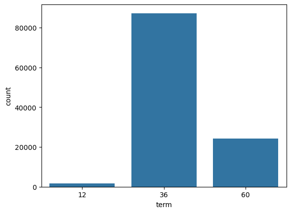
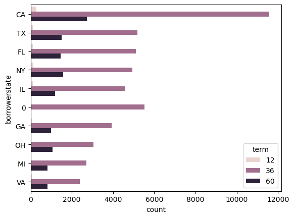
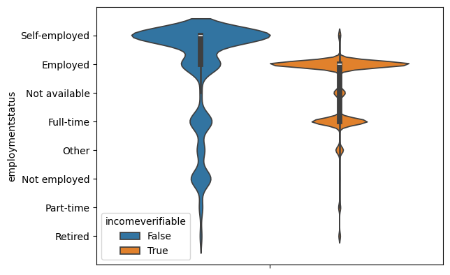
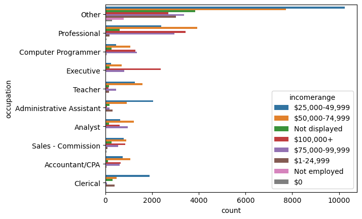
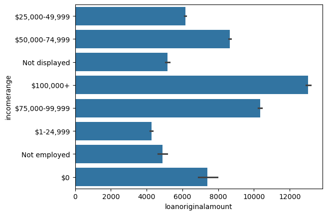
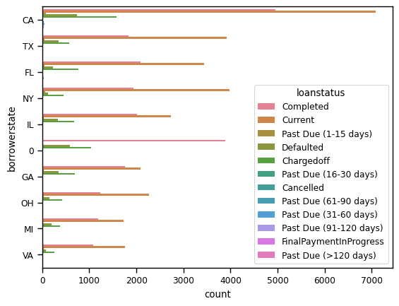

# Python Project - (Prosper loan Dataframe)
## by (Bachor Merlvyn Gabriel)

## Introduction

##### The Prosper Loan dataset is a comprehensive collection of peer-to-peer lending data, provided by Prosper, a leading online lending platform. The dataset contains information on over 113,000 loans issued between 2005 and 2014, including loan characteristics, borrower demographics, and loan performance metrics. This dataset offers a unique opportunity for analysis and insight into the peer-to-peer lending market, enabling researchers and data scientists to explore topics such as credit risk assessment, loan default prediction, and the impact of borrower characteristics on loan outcomes.

##### DATA WRANGLING
- Remove all unwanted columns 
- Remove duplicates
- Fill up NAN rows


```python
import pandas as pd
```


```python
df=pd.read_csv('Prosper Loan (2).csv')
```

The Prosper Loan dataset is a comprehensive collection of peer-to-peer lending data, containing information on over 113,000 loans issued between 2005 and 2014. The dataset has the following structure:

Loan Information
1. LoanNumber: Unique identifier for each loan
2. LoanStatus: Current status of the loan (e.g., "Current", "Defaulted", "Paid")
3. LoanAmount: Amount borrowed by the borrower
4. InterestRate: Interest rate of the loan
5. LoanTerm: Length of the loan (in months)

Borrower Information
1. BorrowerID: Unique identifier for each borrower
2. BorrowerName: Name of the borrower
3. CreditScore: Credit score of the borrower
4. Income: Income of the borrower
5. EmploymentStatus: Employment status of the borrower

Loan Performance
1. Defaulted: Indicator of whether the loan defaulted
2. Paid: Indicator of whether the loan was paid in full
3. LatePayments: Number of late payments made by the borrower
4. LoanOriginated: Date the loan was originated

Additional Features
1. CreditGrade: Prosper's credit grade for the borrower
2. DebtToIncomeRatio: Borrower's debt-to-income ratio
3. IncomeVerifiable: Indicator of whether the borrower's income is verifiable
4. Occupation: Borrower's occupation

This structure provides a comprehensive view of the loan, borrower, and loan performance, enabling analysis and modeling of credit risk, loan default prediction, and other related topics.

##### My interest in this dataset is to explore it and understand our customers better,
##### Get to know who the majority of our customers are, 
##### Does the emolymnet status affect their ability to borrow and repay loan,
##### Understand how loans given out are measured
##### Which payment plan suits our customers best.

##### To solve my insight i am going to be using information from the loan information, borrower information, loan performance

##### First step we clean the data by dropping the uncessary columns 


```python
df=df.drop(columns='OnTimeProsperPayments')
```


```python
df=df.drop(columns='GroupKey')
```


```python
df=df.drop(columns='ProsperPaymentsLessThanOneMonthLate')
```


```python
df=df.drop(columns='ProsperPaymentsOneMonthPlusLate')
```


```python
df=df.drop(columns='ProsperPrincipalBorrowed')
```


```python
df=df.drop(columns='ProsperPrincipalOutstanding')
```


```python
df=df.drop(columns='ScorexChangeAtTimeOfListing')
```


```python
df=df.drop(columns='LoanCurrentDaysDelinquent')
```


```python
df=df.drop(columns='LoanFirstDefaultedCycleNumber')
```


```python
df=df.drop(columns='TotalProsperPaymentsBilled')
```


```python
df=df.drop(columns='LP_CustomerPrincipalPayments')
```


```python
df=df.drop(columns='LP_ServiceFees')
```


```python
df=df.drop(columns='LP_CollectionFees')
```


```python
df=df.drop(columns='LP_GrossPrincipalLoss')
```


```python
df=df.drop(columns='LP_NonPrincipalRecoverypayments')
```


```python
df=df.drop(columns='LP_InterestandFees')
```


```python
df=df.drop(columns='LP_NetPrincipalLoss')
```


```python
df=df.drop(columns='CreditGrade')
```


```python
df=df.drop(columns='TotalProsperLoans')
```


```python
df=df.drop(columns='ClosedDate')
```


```python
df=df.drop(columns='ProsperRating (numeric)')
```


```python
df=df.drop(columns='ProsperRating (Alpha)')
```


```python
df=df.drop(columns='ListingCategory (numeric)')
```


```python
df=df.drop(columns='EmploymentStatusDuration')
```


```python
df=df.drop(columns='EstimatedEffectiveYield')
```


```python
df=df.drop(columns='CurrentDelinquencies')
```


```python
df=df.drop(columns='AmountDelinquent')
```


```python
df=df.drop(columns='InvestmentFromFriendsCount')
```


```python
df=df.drop(columns='InvestmentFromFriendsAmount')
```


```python
df=df.drop(columns='Recommendations')
```


```python
df=df.drop(columns='Investors')
```


```python
df=df.drop(columns='EstimatedLoss')
```


```python
df=df.drop(columns='EstimatedReturn')
```


```python
df=df.drop(columns='LenderYield')
```


```python
df=df.drop(columns='BankcardUtilization')
```


```python
df=df.drop(columns='TradesNeverDelinquent (percentage)')
```


```python
df=df.drop(columns='RevolvingCreditBalance')
```


```python
df=df.drop(columns='MemberKey')
```


```python
df=df.drop(columns='PercentFunded')
```


```python
df=df.drop(columns='ListingKey')
```


```python
df=df.drop(columns='LoanKey')
```


```python
df.info()
```

    <class 'pandas.core.frame.DataFrame'>
    RangeIndex: 113937 entries, 0 to 113936
    Data columns (total 40 columns):
     #   Column                       Non-Null Count   Dtype  
    ---  ------                       --------------   -----  
     0   ListingNumber                113937 non-null  int64  
     1   ListingCreationDate          113937 non-null  object 
     2   Term                         113937 non-null  int64  
     3   LoanStatus                   113937 non-null  object 
     4   BorrowerAPR                  113912 non-null  float64
     5   BorrowerRate                 113937 non-null  float64
     6   ProsperScore                 84853 non-null   float64
     7   BorrowerState                108422 non-null  object 
     8   Occupation                   110349 non-null  object 
     9   EmploymentStatus             111682 non-null  object 
     10  IsBorrowerHomeowner          113937 non-null  bool   
     11  CurrentlyInGroup             113937 non-null  bool   
     12  DateCreditPulled             113937 non-null  object 
     13  CreditScoreRangeLower        113346 non-null  float64
     14  CreditScoreRangeUpper        113346 non-null  float64
     15  FirstRecordedCreditLine      113240 non-null  object 
     16  CurrentCreditLines           106333 non-null  float64
     17  OpenCreditLines              106333 non-null  float64
     18  TotalCreditLinespast7years   113240 non-null  float64
     19  OpenRevolvingAccounts        113937 non-null  int64  
     20  OpenRevolvingMonthlyPayment  113937 non-null  int64  
     21  InquiriesLast6Months         113240 non-null  float64
     22  TotalInquiries               112778 non-null  float64
     23  DelinquenciesLast7Years      112947 non-null  float64
     24  PublicRecordsLast10Years     113240 non-null  float64
     25  PublicRecordsLast12Months    106333 non-null  float64
     26  AvailableBankcardCredit      106393 non-null  float64
     27  TotalTrades                  106393 non-null  float64
     28  TradesOpenedLast6Months      106393 non-null  float64
     29  DebtToIncomeRatio            105383 non-null  float64
     30  IncomeRange                  113937 non-null  object 
     31  IncomeVerifiable             113937 non-null  bool   
     32  StatedMonthlyIncome          113937 non-null  float64
     33  LoanMonthsSinceOrigination   113937 non-null  int64  
     34  LoanNumber                   113937 non-null  int64  
     35  LoanOriginalAmount           113937 non-null  int64  
     36  LoanOriginationDate          113937 non-null  object 
     37  LoanOriginationQuarter       113937 non-null  object 
     38  MonthlyLoanPayment           113937 non-null  float64
     39  LP_CustomerPayments          113937 non-null  float64
    dtypes: bool(3), float64(20), int64(7), object(10)
    memory usage: 32.5+ MB
    

##### Change the column name to lower case for easy access( my own preference)


```python
df.columns=df.columns.str.lower()
```


```python
df.listingnumber.value_counts()
```


    listingnumber
    951186     6
    882888     4
    1056749    4
    892845     4
    1057901    4
              ..
    1101372    1
    343935     1
    128572     1
    584331     1
    1140093    1
    Name: count, Length: 113066, dtype: int64


##### Remove duplicate from the column


```python
df=df.drop_duplicates('listingnumber', keep='last')
```


```python
df
```


<div>
<style scoped>
    .dataframe tbody tr th:only-of-type {
        vertical-align: middle;
    }

    .dataframe tbody tr th {
        vertical-align: top;
    }

    .dataframe thead th {
        text-align: right;
    }
</style>
<table border="1" class="dataframe">
  <thead>
    <tr style="text-align: right;">
      <th></th>
      <th>listingnumber</th>
      <th>listingcreationdate</th>
      <th>term</th>
      <th>loanstatus</th>
      <th>borrowerapr</th>
      <th>borrowerrate</th>
      <th>prosperscore</th>
      <th>borrowerstate</th>
      <th>occupation</th>
      <th>employmentstatus</th>
      <th>...</th>
      <th>incomerange</th>
      <th>incomeverifiable</th>
      <th>statedmonthlyincome</th>
      <th>loanmonthssinceorigination</th>
      <th>loannumber</th>
      <th>loanoriginalamount</th>
      <th>loanoriginationdate</th>
      <th>loanoriginationquarter</th>
      <th>monthlyloanpayment</th>
      <th>lp_customerpayments</th>
    </tr>
  </thead>
  <tbody>
    <tr>
      <th>0</th>
      <td>193129</td>
      <td>09:29.3</td>
      <td>36</td>
      <td>Completed</td>
      <td>0.16516</td>
      <td>0.1580</td>
      <td>NaN</td>
      <td>CO</td>
      <td>Other</td>
      <td>Self-employed</td>
      <td>...</td>
      <td>$25,000-49,999</td>
      <td>True</td>
      <td>3083.333333</td>
      <td>78</td>
      <td>19141</td>
      <td>9425</td>
      <td>12/09/2007 00:00</td>
      <td>Q3 2007</td>
      <td>330.43</td>
      <td>11396.1400</td>
    </tr>
    <tr>
      <th>1</th>
      <td>1209647</td>
      <td>28:07.9</td>
      <td>36</td>
      <td>Current</td>
      <td>0.12016</td>
      <td>0.0920</td>
      <td>7.0</td>
      <td>CO</td>
      <td>Professional</td>
      <td>Employed</td>
      <td>...</td>
      <td>$50,000-74,999</td>
      <td>True</td>
      <td>6125.000000</td>
      <td>0</td>
      <td>134815</td>
      <td>10000</td>
      <td>03/03/2014 00:00</td>
      <td>Q1 2014</td>
      <td>318.93</td>
      <td>0.0000</td>
    </tr>
    <tr>
      <th>2</th>
      <td>81716</td>
      <td>00:47.1</td>
      <td>36</td>
      <td>Completed</td>
      <td>0.28269</td>
      <td>0.2750</td>
      <td>NaN</td>
      <td>GA</td>
      <td>Other</td>
      <td>Not available</td>
      <td>...</td>
      <td>Not displayed</td>
      <td>True</td>
      <td>2083.333333</td>
      <td>86</td>
      <td>6466</td>
      <td>3001</td>
      <td>17/01/2007 00:00</td>
      <td>Q1 2007</td>
      <td>123.32</td>
      <td>4186.6300</td>
    </tr>
    <tr>
      <th>3</th>
      <td>658116</td>
      <td>02:35.0</td>
      <td>36</td>
      <td>Current</td>
      <td>0.12528</td>
      <td>0.0974</td>
      <td>9.0</td>
      <td>GA</td>
      <td>Skilled Labor</td>
      <td>Employed</td>
      <td>...</td>
      <td>$25,000-49,999</td>
      <td>True</td>
      <td>2875.000000</td>
      <td>16</td>
      <td>77296</td>
      <td>10000</td>
      <td>01/11/2012 00:00</td>
      <td>Q4 2012</td>
      <td>321.45</td>
      <td>5143.2000</td>
    </tr>
    <tr>
      <th>4</th>
      <td>909464</td>
      <td>38:39.1</td>
      <td>36</td>
      <td>Current</td>
      <td>0.24614</td>
      <td>0.2085</td>
      <td>4.0</td>
      <td>MN</td>
      <td>Executive</td>
      <td>Employed</td>
      <td>...</td>
      <td>$100,000+</td>
      <td>True</td>
      <td>9583.333333</td>
      <td>6</td>
      <td>102670</td>
      <td>15000</td>
      <td>20/09/2013 00:00</td>
      <td>Q3 2013</td>
      <td>563.97</td>
      <td>2819.8500</td>
    </tr>
    <tr>
      <th>...</th>
      <td>...</td>
      <td>...</td>
      <td>...</td>
      <td>...</td>
      <td>...</td>
      <td>...</td>
      <td>...</td>
      <td>...</td>
      <td>...</td>
      <td>...</td>
      <td>...</td>
      <td>...</td>
      <td>...</td>
      <td>...</td>
      <td>...</td>
      <td>...</td>
      <td>...</td>
      <td>...</td>
      <td>...</td>
      <td>...</td>
      <td>...</td>
    </tr>
    <tr>
      <th>113932</th>
      <td>753087</td>
      <td>55:02.7</td>
      <td>36</td>
      <td>Current</td>
      <td>0.22354</td>
      <td>0.1864</td>
      <td>5.0</td>
      <td>IL</td>
      <td>Food Service Management</td>
      <td>Employed</td>
      <td>...</td>
      <td>$50,000-74,999</td>
      <td>True</td>
      <td>4333.333333</td>
      <td>11</td>
      <td>88485</td>
      <td>10000</td>
      <td>22/04/2013 00:00</td>
      <td>Q2 2013</td>
      <td>364.74</td>
      <td>3647.4000</td>
    </tr>
    <tr>
      <th>113933</th>
      <td>537216</td>
      <td>42:55.3</td>
      <td>36</td>
      <td>FinalPaymentInProgress</td>
      <td>0.13220</td>
      <td>0.1110</td>
      <td>8.0</td>
      <td>PA</td>
      <td>Professional</td>
      <td>Employed</td>
      <td>...</td>
      <td>$75,000-99,999</td>
      <td>True</td>
      <td>8041.666667</td>
      <td>28</td>
      <td>55801</td>
      <td>2000</td>
      <td>07/11/2011 00:00</td>
      <td>Q4 2011</td>
      <td>65.57</td>
      <td>2330.5500</td>
    </tr>
    <tr>
      <th>113934</th>
      <td>1069178</td>
      <td>49:12.7</td>
      <td>60</td>
      <td>Current</td>
      <td>0.23984</td>
      <td>0.2150</td>
      <td>3.0</td>
      <td>TX</td>
      <td>Other</td>
      <td>Employed</td>
      <td>...</td>
      <td>$25,000-49,999</td>
      <td>True</td>
      <td>2875.000000</td>
      <td>3</td>
      <td>123122</td>
      <td>10000</td>
      <td>23/12/2013 00:00</td>
      <td>Q4 2013</td>
      <td>273.35</td>
      <td>546.7000</td>
    </tr>
    <tr>
      <th>113935</th>
      <td>539056</td>
      <td>18:26.6</td>
      <td>60</td>
      <td>Completed</td>
      <td>0.28408</td>
      <td>0.2605</td>
      <td>5.0</td>
      <td>GA</td>
      <td>Food Service</td>
      <td>Full-time</td>
      <td>...</td>
      <td>$25,000-49,999</td>
      <td>True</td>
      <td>3875.000000</td>
      <td>28</td>
      <td>56401</td>
      <td>15000</td>
      <td>21/11/2011 00:00</td>
      <td>Q4 2011</td>
      <td>449.55</td>
      <td>21122.5600</td>
    </tr>
    <tr>
      <th>113936</th>
      <td>1140093</td>
      <td>27:37.7</td>
      <td>36</td>
      <td>Current</td>
      <td>0.13189</td>
      <td>0.1039</td>
      <td>7.0</td>
      <td>NY</td>
      <td>Professor</td>
      <td>Employed</td>
      <td>...</td>
      <td>$50,000-74,999</td>
      <td>True</td>
      <td>4583.333333</td>
      <td>2</td>
      <td>127508</td>
      <td>2000</td>
      <td>21/01/2014 00:00</td>
      <td>Q1 2014</td>
      <td>64.90</td>
      <td>64.3307</td>
    </tr>
  </tbody>
</table>
<p>113066 rows × 40 columns</p>
</div>


```python
df.isnull().sum()
```


    listingnumber                      0
    listingcreationdate                0
    term                               0
    loanstatus                         0
    borrowerapr                       25
    borrowerrate                       0
    prosperscore                   29084
    borrowerstate                   5515
    occupation                      3529
    employmentstatus                2255
    isborrowerhomeowner                0
    currentlyingroup                   0
    datecreditpulled                   0
    creditscorerangelower            591
    creditscorerangeupper            591
    firstrecordedcreditline          697
    currentcreditlines              7604
    opencreditlines                 7604
    totalcreditlinespast7years       697
    openrevolvingaccounts              0
    openrevolvingmonthlypayment        0
    inquirieslast6months             697
    totalinquiries                  1159
    delinquencieslast7years          990
    publicrecordslast10years         697
    publicrecordslast12months       7604
    availablebankcardcredit         7544
    totaltrades                     7544
    tradesopenedlast6months         7544
    debttoincomeratio               8472
    incomerange                        0
    incomeverifiable                   0
    statedmonthlyincome                0
    loanmonthssinceorigination         0
    loannumber                         0
    loanoriginalamount                 0
    loanoriginationdate                0
    loanoriginationquarter             0
    monthlyloanpayment                 0
    lp_customerpayments                0
    dtype: int64


##### Fill up the unknown value in various columns


```python
df.prosperscore=df.prosperscore.fillna(0)
```


```python
df.borrowerstate=df.borrowerstate.fillna(0)
```


```python
df.occupation=df.occupation.fillna('Other')
```


```python
df.creditscorerangelower=df.creditscorerangelower.fillna(0)
```


```python
df.creditscorerangeupper=df.creditscorerangeupper.fillna(0)
```


```python
df.firstrecordedcreditline=df.firstrecordedcreditline.fillna('01/01/2006')
```


```python
df.currentcreditlines=df.currentcreditlines.fillna(0)
```


```python
df.opencreditlines=df.opencreditlines.fillna(0)
```


```python
df.totalcreditlinespast7years=df.totalcreditlinespast7years.fillna(0)
```


```python
df.inquirieslast6months=df.inquirieslast6months.fillna(0)
```


```python
df.totalinquiries=df.totalinquiries.fillna(0)
```


```python
df.delinquencieslast7years=df.delinquencieslast7years.fillna(0)
```


```python
df.publicrecordslast10years=df.publicrecordslast10years.fillna(0)
```


```python
df.publicrecordslast12months=df.publicrecordslast12months.fillna(0)
```


```python
df.availablebankcardcredit=df.availablebankcardcredit.fillna(0)
```


```python
df.totaltrades=df.totaltrades.fillna(0)
```


```python
df.tradesopenedlast6months=df.tradesopenedlast6months.fillna(0)
```


```python
df.debttoincomeratio=df.debttoincomeratio.fillna(0.00)
```


```python
df.borrowerapr=df.borrowerapr.fillna(0.00)
```


```python
df.isnull().values.any()
```


    True


```python
df
```


<div>
<style scoped>
    .dataframe tbody tr th:only-of-type {
        vertical-align: middle;
    }

    .dataframe tbody tr th {
        vertical-align: top;
    }

    .dataframe thead th {
        text-align: right;
    }
</style>
<table border="1" class="dataframe">
  <thead>
    <tr style="text-align: right;">
      <th></th>
      <th>listingnumber</th>
      <th>listingcreationdate</th>
      <th>term</th>
      <th>loanstatus</th>
      <th>borrowerapr</th>
      <th>borrowerrate</th>
      <th>prosperscore</th>
      <th>borrowerstate</th>
      <th>occupation</th>
      <th>employmentstatus</th>
      <th>...</th>
      <th>incomerange</th>
      <th>incomeverifiable</th>
      <th>statedmonthlyincome</th>
      <th>loanmonthssinceorigination</th>
      <th>loannumber</th>
      <th>loanoriginalamount</th>
      <th>loanoriginationdate</th>
      <th>loanoriginationquarter</th>
      <th>monthlyloanpayment</th>
      <th>lp_customerpayments</th>
    </tr>
  </thead>
  <tbody>
    <tr>
      <th>0</th>
      <td>193129</td>
      <td>09:29.3</td>
      <td>36</td>
      <td>Completed</td>
      <td>0.16516</td>
      <td>0.1580</td>
      <td>0.0</td>
      <td>CO</td>
      <td>Other</td>
      <td>Self-employed</td>
      <td>...</td>
      <td>$25,000-49,999</td>
      <td>True</td>
      <td>3083.333333</td>
      <td>78</td>
      <td>19141</td>
      <td>9425</td>
      <td>12/09/2007 00:00</td>
      <td>Q3 2007</td>
      <td>330.43</td>
      <td>11396.1400</td>
    </tr>
    <tr>
      <th>1</th>
      <td>1209647</td>
      <td>28:07.9</td>
      <td>36</td>
      <td>Current</td>
      <td>0.12016</td>
      <td>0.0920</td>
      <td>7.0</td>
      <td>CO</td>
      <td>Professional</td>
      <td>Employed</td>
      <td>...</td>
      <td>$50,000-74,999</td>
      <td>True</td>
      <td>6125.000000</td>
      <td>0</td>
      <td>134815</td>
      <td>10000</td>
      <td>03/03/2014 00:00</td>
      <td>Q1 2014</td>
      <td>318.93</td>
      <td>0.0000</td>
    </tr>
    <tr>
      <th>2</th>
      <td>81716</td>
      <td>00:47.1</td>
      <td>36</td>
      <td>Completed</td>
      <td>0.28269</td>
      <td>0.2750</td>
      <td>0.0</td>
      <td>GA</td>
      <td>Other</td>
      <td>Not available</td>
      <td>...</td>
      <td>Not displayed</td>
      <td>True</td>
      <td>2083.333333</td>
      <td>86</td>
      <td>6466</td>
      <td>3001</td>
      <td>17/01/2007 00:00</td>
      <td>Q1 2007</td>
      <td>123.32</td>
      <td>4186.6300</td>
    </tr>
    <tr>
      <th>3</th>
      <td>658116</td>
      <td>02:35.0</td>
      <td>36</td>
      <td>Current</td>
      <td>0.12528</td>
      <td>0.0974</td>
      <td>9.0</td>
      <td>GA</td>
      <td>Skilled Labor</td>
      <td>Employed</td>
      <td>...</td>
      <td>$25,000-49,999</td>
      <td>True</td>
      <td>2875.000000</td>
      <td>16</td>
      <td>77296</td>
      <td>10000</td>
      <td>01/11/2012 00:00</td>
      <td>Q4 2012</td>
      <td>321.45</td>
      <td>5143.2000</td>
    </tr>
    <tr>
      <th>4</th>
      <td>909464</td>
      <td>38:39.1</td>
      <td>36</td>
      <td>Current</td>
      <td>0.24614</td>
      <td>0.2085</td>
      <td>4.0</td>
      <td>MN</td>
      <td>Executive</td>
      <td>Employed</td>
      <td>...</td>
      <td>$100,000+</td>
      <td>True</td>
      <td>9583.333333</td>
      <td>6</td>
      <td>102670</td>
      <td>15000</td>
      <td>20/09/2013 00:00</td>
      <td>Q3 2013</td>
      <td>563.97</td>
      <td>2819.8500</td>
    </tr>
    <tr>
      <th>...</th>
      <td>...</td>
      <td>...</td>
      <td>...</td>
      <td>...</td>
      <td>...</td>
      <td>...</td>
      <td>...</td>
      <td>...</td>
      <td>...</td>
      <td>...</td>
      <td>...</td>
      <td>...</td>
      <td>...</td>
      <td>...</td>
      <td>...</td>
      <td>...</td>
      <td>...</td>
      <td>...</td>
      <td>...</td>
      <td>...</td>
      <td>...</td>
    </tr>
    <tr>
      <th>113932</th>
      <td>753087</td>
      <td>55:02.7</td>
      <td>36</td>
      <td>Current</td>
      <td>0.22354</td>
      <td>0.1864</td>
      <td>5.0</td>
      <td>IL</td>
      <td>Food Service Management</td>
      <td>Employed</td>
      <td>...</td>
      <td>$50,000-74,999</td>
      <td>True</td>
      <td>4333.333333</td>
      <td>11</td>
      <td>88485</td>
      <td>10000</td>
      <td>22/04/2013 00:00</td>
      <td>Q2 2013</td>
      <td>364.74</td>
      <td>3647.4000</td>
    </tr>
    <tr>
      <th>113933</th>
      <td>537216</td>
      <td>42:55.3</td>
      <td>36</td>
      <td>FinalPaymentInProgress</td>
      <td>0.13220</td>
      <td>0.1110</td>
      <td>8.0</td>
      <td>PA</td>
      <td>Professional</td>
      <td>Employed</td>
      <td>...</td>
      <td>$75,000-99,999</td>
      <td>True</td>
      <td>8041.666667</td>
      <td>28</td>
      <td>55801</td>
      <td>2000</td>
      <td>07/11/2011 00:00</td>
      <td>Q4 2011</td>
      <td>65.57</td>
      <td>2330.5500</td>
    </tr>
    <tr>
      <th>113934</th>
      <td>1069178</td>
      <td>49:12.7</td>
      <td>60</td>
      <td>Current</td>
      <td>0.23984</td>
      <td>0.2150</td>
      <td>3.0</td>
      <td>TX</td>
      <td>Other</td>
      <td>Employed</td>
      <td>...</td>
      <td>$25,000-49,999</td>
      <td>True</td>
      <td>2875.000000</td>
      <td>3</td>
      <td>123122</td>
      <td>10000</td>
      <td>23/12/2013 00:00</td>
      <td>Q4 2013</td>
      <td>273.35</td>
      <td>546.7000</td>
    </tr>
    <tr>
      <th>113935</th>
      <td>539056</td>
      <td>18:26.6</td>
      <td>60</td>
      <td>Completed</td>
      <td>0.28408</td>
      <td>0.2605</td>
      <td>5.0</td>
      <td>GA</td>
      <td>Food Service</td>
      <td>Full-time</td>
      <td>...</td>
      <td>$25,000-49,999</td>
      <td>True</td>
      <td>3875.000000</td>
      <td>28</td>
      <td>56401</td>
      <td>15000</td>
      <td>21/11/2011 00:00</td>
      <td>Q4 2011</td>
      <td>449.55</td>
      <td>21122.5600</td>
    </tr>
    <tr>
      <th>113936</th>
      <td>1140093</td>
      <td>27:37.7</td>
      <td>36</td>
      <td>Current</td>
      <td>0.13189</td>
      <td>0.1039</td>
      <td>7.0</td>
      <td>NY</td>
      <td>Professor</td>
      <td>Employed</td>
      <td>...</td>
      <td>$50,000-74,999</td>
      <td>True</td>
      <td>4583.333333</td>
      <td>2</td>
      <td>127508</td>
      <td>2000</td>
      <td>21/01/2014 00:00</td>
      <td>Q1 2014</td>
      <td>64.90</td>
      <td>64.3307</td>
    </tr>
  </tbody>
</table>
<p>113066 rows × 40 columns</p>
</div>


```python
df=df.drop(columns='listingcreationdate')
```


```python
df
```


<div>
<style scoped>
    .dataframe tbody tr th:only-of-type {
        vertical-align: middle;
    }

    .dataframe tbody tr th {
        vertical-align: top;
    }

    .dataframe thead th {
        text-align: right;
    }
</style>
<table border="1" class="dataframe">
  <thead>
    <tr style="text-align: right;">
      <th></th>
      <th>listingnumber</th>
      <th>term</th>
      <th>loanstatus</th>
      <th>borrowerapr</th>
      <th>borrowerrate</th>
      <th>prosperscore</th>
      <th>borrowerstate</th>
      <th>occupation</th>
      <th>employmentstatus</th>
      <th>isborrowerhomeowner</th>
      <th>...</th>
      <th>incomerange</th>
      <th>incomeverifiable</th>
      <th>statedmonthlyincome</th>
      <th>loanmonthssinceorigination</th>
      <th>loannumber</th>
      <th>loanoriginalamount</th>
      <th>loanoriginationdate</th>
      <th>loanoriginationquarter</th>
      <th>monthlyloanpayment</th>
      <th>lp_customerpayments</th>
    </tr>
  </thead>
  <tbody>
    <tr>
      <th>0</th>
      <td>193129</td>
      <td>36</td>
      <td>Completed</td>
      <td>0.16516</td>
      <td>0.1580</td>
      <td>0.0</td>
      <td>CO</td>
      <td>Other</td>
      <td>Self-employed</td>
      <td>True</td>
      <td>...</td>
      <td>$25,000-49,999</td>
      <td>True</td>
      <td>3083.333333</td>
      <td>78</td>
      <td>19141</td>
      <td>9425</td>
      <td>12/09/2007 00:00</td>
      <td>Q3 2007</td>
      <td>330.43</td>
      <td>11396.1400</td>
    </tr>
    <tr>
      <th>1</th>
      <td>1209647</td>
      <td>36</td>
      <td>Current</td>
      <td>0.12016</td>
      <td>0.0920</td>
      <td>7.0</td>
      <td>CO</td>
      <td>Professional</td>
      <td>Employed</td>
      <td>False</td>
      <td>...</td>
      <td>$50,000-74,999</td>
      <td>True</td>
      <td>6125.000000</td>
      <td>0</td>
      <td>134815</td>
      <td>10000</td>
      <td>03/03/2014 00:00</td>
      <td>Q1 2014</td>
      <td>318.93</td>
      <td>0.0000</td>
    </tr>
    <tr>
      <th>2</th>
      <td>81716</td>
      <td>36</td>
      <td>Completed</td>
      <td>0.28269</td>
      <td>0.2750</td>
      <td>0.0</td>
      <td>GA</td>
      <td>Other</td>
      <td>Not available</td>
      <td>False</td>
      <td>...</td>
      <td>Not displayed</td>
      <td>True</td>
      <td>2083.333333</td>
      <td>86</td>
      <td>6466</td>
      <td>3001</td>
      <td>17/01/2007 00:00</td>
      <td>Q1 2007</td>
      <td>123.32</td>
      <td>4186.6300</td>
    </tr>
    <tr>
      <th>3</th>
      <td>658116</td>
      <td>36</td>
      <td>Current</td>
      <td>0.12528</td>
      <td>0.0974</td>
      <td>9.0</td>
      <td>GA</td>
      <td>Skilled Labor</td>
      <td>Employed</td>
      <td>True</td>
      <td>...</td>
      <td>$25,000-49,999</td>
      <td>True</td>
      <td>2875.000000</td>
      <td>16</td>
      <td>77296</td>
      <td>10000</td>
      <td>01/11/2012 00:00</td>
      <td>Q4 2012</td>
      <td>321.45</td>
      <td>5143.2000</td>
    </tr>
    <tr>
      <th>4</th>
      <td>909464</td>
      <td>36</td>
      <td>Current</td>
      <td>0.24614</td>
      <td>0.2085</td>
      <td>4.0</td>
      <td>MN</td>
      <td>Executive</td>
      <td>Employed</td>
      <td>True</td>
      <td>...</td>
      <td>$100,000+</td>
      <td>True</td>
      <td>9583.333333</td>
      <td>6</td>
      <td>102670</td>
      <td>15000</td>
      <td>20/09/2013 00:00</td>
      <td>Q3 2013</td>
      <td>563.97</td>
      <td>2819.8500</td>
    </tr>
    <tr>
      <th>...</th>
      <td>...</td>
      <td>...</td>
      <td>...</td>
      <td>...</td>
      <td>...</td>
      <td>...</td>
      <td>...</td>
      <td>...</td>
      <td>...</td>
      <td>...</td>
      <td>...</td>
      <td>...</td>
      <td>...</td>
      <td>...</td>
      <td>...</td>
      <td>...</td>
      <td>...</td>
      <td>...</td>
      <td>...</td>
      <td>...</td>
      <td>...</td>
    </tr>
    <tr>
      <th>113932</th>
      <td>753087</td>
      <td>36</td>
      <td>Current</td>
      <td>0.22354</td>
      <td>0.1864</td>
      <td>5.0</td>
      <td>IL</td>
      <td>Food Service Management</td>
      <td>Employed</td>
      <td>True</td>
      <td>...</td>
      <td>$50,000-74,999</td>
      <td>True</td>
      <td>4333.333333</td>
      <td>11</td>
      <td>88485</td>
      <td>10000</td>
      <td>22/04/2013 00:00</td>
      <td>Q2 2013</td>
      <td>364.74</td>
      <td>3647.4000</td>
    </tr>
    <tr>
      <th>113933</th>
      <td>537216</td>
      <td>36</td>
      <td>FinalPaymentInProgress</td>
      <td>0.13220</td>
      <td>0.1110</td>
      <td>8.0</td>
      <td>PA</td>
      <td>Professional</td>
      <td>Employed</td>
      <td>True</td>
      <td>...</td>
      <td>$75,000-99,999</td>
      <td>True</td>
      <td>8041.666667</td>
      <td>28</td>
      <td>55801</td>
      <td>2000</td>
      <td>07/11/2011 00:00</td>
      <td>Q4 2011</td>
      <td>65.57</td>
      <td>2330.5500</td>
    </tr>
    <tr>
      <th>113934</th>
      <td>1069178</td>
      <td>60</td>
      <td>Current</td>
      <td>0.23984</td>
      <td>0.2150</td>
      <td>3.0</td>
      <td>TX</td>
      <td>Other</td>
      <td>Employed</td>
      <td>True</td>
      <td>...</td>
      <td>$25,000-49,999</td>
      <td>True</td>
      <td>2875.000000</td>
      <td>3</td>
      <td>123122</td>
      <td>10000</td>
      <td>23/12/2013 00:00</td>
      <td>Q4 2013</td>
      <td>273.35</td>
      <td>546.7000</td>
    </tr>
    <tr>
      <th>113935</th>
      <td>539056</td>
      <td>60</td>
      <td>Completed</td>
      <td>0.28408</td>
      <td>0.2605</td>
      <td>5.0</td>
      <td>GA</td>
      <td>Food Service</td>
      <td>Full-time</td>
      <td>True</td>
      <td>...</td>
      <td>$25,000-49,999</td>
      <td>True</td>
      <td>3875.000000</td>
      <td>28</td>
      <td>56401</td>
      <td>15000</td>
      <td>21/11/2011 00:00</td>
      <td>Q4 2011</td>
      <td>449.55</td>
      <td>21122.5600</td>
    </tr>
    <tr>
      <th>113936</th>
      <td>1140093</td>
      <td>36</td>
      <td>Current</td>
      <td>0.13189</td>
      <td>0.1039</td>
      <td>7.0</td>
      <td>NY</td>
      <td>Professor</td>
      <td>Employed</td>
      <td>False</td>
      <td>...</td>
      <td>$50,000-74,999</td>
      <td>True</td>
      <td>4583.333333</td>
      <td>2</td>
      <td>127508</td>
      <td>2000</td>
      <td>21/01/2014 00:00</td>
      <td>Q1 2014</td>
      <td>64.90</td>
      <td>64.3307</td>
    </tr>
  </tbody>
</table>
<p>113066 rows × 39 columns</p>
</div>


```python
df['loanoriginationdate']=pd.to_datetime(df['loanoriginationdate'], errors='coerce')
```

##### After cleaning data has beeen done, we move to visualization


```python
import numpy as np
```


```python
import matplotlib.pyplot as plt
```


```python
import seaborn as sns
```

##### UNIVARIATE VISUALIZATION

#### Q1) WHAT IS THE EMPLOYMNET STATUS OF MAJORITY OF OUR CUSTOMERS?


```python
sns.countplot(data=df, y='employmentstatus')
```


    <Axes: xlabel='count', ylabel='employmentstatus'>


    

    


##### OBSERVATION; 
FROM THE ABOVE CHART WE CAN DEDUCE THAT A LARGE PERCENT OF OUR CUSTOMERS ARE EMPLOYED AND WORKING, WHILE A FEW OF THEM ARE RETIRED,UNEMPLOYED OR WORK PART TIME.

##### Q2) IS MAJORITY OF OUR CUSTOMERS HOUSE OWNERS OR NOT?


```python
sns.countplot(data=df, x='isborrowerhomeowner')
```


    <Axes: xlabel='isborrowerhomeowner', ylabel='count'>


    

    


##### OBSERVATION; 
GIVEN THE CHART ABOVE WE CAN CONCLUDE THAT THE NUMBERS OF CUSTOMERS THAT ARE HOUSE OWNERS ARE SLIGHTLY HIGHER THAN THOSE THAT ARE NOT.

##### Q3) WHAT IS THE PRESENT LOAN STATUS OF OUR CUSTOMERS?


```python
sns.countplot(data=df, y='loanstatus')
```


    <Axes: xlabel='count', ylabel='loanstatus'>


    

    


##### OBSERVATION;
WE HAVE A LARGE NUMBER OF CUSTOMERS PRESENTLY ON CURRENT ONGOING LOANS,FOLLOWED BY COMPLETED LOAN PAYMENT. THEN WE CAN SEE FROM THE CHART WE HAVE A GOOD NUMBER OF CHARGED OFF LOANS, DEFAULTED AND VERY LITTLE NUMBER OF CUSTOMERS THAT HAVE JUST PASSED THEIR DUE DATE.

##### Q4) HOW MANY OF OUR CUSTOMERS HAVE THEIR INCOME BEEN VERIFIED?


```python
sns.countplot(data=df, x='incomeverifiable')
```


    <Axes: xlabel='incomeverifiable', ylabel='count'>


    

    


##### OBSERVATION;
FROM THE CHART IT IS EVIDENT THAT MAJORITY OF OUR COSTUMERS INCOME HAS BEEN VERIFIED

##### Q5) WHAT PAYMENT DURATION IS MOST FAVORABLE TO OUR CUSTOMERS?


```python
sns.countplot(data=df, x='term')
```


    <Axes: xlabel='term', ylabel='count'>


    

    


##### OBSERVATION;
MAJORITY OF OUR CUSTOMERS PREFER THE 36 MONTHS PLAN WHICH IS VISIBLE THROUGH THE CHART ABOVE

##### BIVARIATE VISUALIZATION

##### Q1) WHICH PAYMENT PLAN IS PREFERED BY OUR CUSTOMERS IN THE TOP BORROW STATE?


```python
sns.countplot(y="borrowerstate", hue="term", data=df, order=df.borrowerstate.value_counts().iloc[:10].index)
```


    <Axes: xlabel='count', ylabel='borrowerstate'>


    

    


##### OBSERVATION; 
AS EARLIER CONFIRMED IN OUR PREVIOUS VISUAL CHART ALL OUR TOP STATES  HAS A HIGH NUMBER OF COSTUMERS OPT FOR THE 36 MONTH REPAYMENT PLAN

##### Q2) WAS THE CUSTOMERS INCOME VERIFIABLE IN ALL EMPLOYMENT STATUS?


```python
sns.violinplot( data=df,  y='employmentstatus', hue='incomeverifiable')
```


    <Axes: ylabel='employmentstatus'>


    

    


##### OBSERVATION;
WE CAN SEE THROUGH THE CHART ABOVE THAT WE WERE ONLY AGE TO VERIFY THE INCOME OF THE FULL TIME WORKERS AND THE EMPLOYED. WHILE THE REST HAVE NOT BEEN VERIFIED

##### Q3) WHATS THE HIGHEST INCOME RANGE OF THE TOP OCCUPATION?


```python
sns.countplot(y="occupation", hue="incomerange", data=df, order=df.occupation.value_counts().iloc[:10].index)
```


    <Axes: xlabel='count', ylabel='occupation'>


    

    


##### OBSERVATION;
GIVEN THE CHART ABOVE, WE CAN DEDUCE THAT FOR CLERICAL ITS IN THE RANGE OF 25K-50K, ACCOUNTANT IS 50K-75K, SALES IS ALSO 50K-75K, ANALYST ALSO IS 50K-75K, ADMIN ASSISTANT IS 25K-50K, TEACHER IS 50K-75K, EXECUTIVE IS 100K AND ABOVE, COMPUTER PRGRAMMER IS 75K-100K, PROFESSIONAL IS 50K-75K AND OTHERS IS 25K-50K

##### Q4) DOES THEIR INCOME RANGE AFFECT THE AMOUNT OF LOAN GIVEN?


```python
sns.barplot( data=df, y='incomerange', x='loanoriginalamount')
```


    <Axes: xlabel='loanoriginalamount', ylabel='incomerange'>


    

    


##### OBSERVATION; 
ITS EVIDENT THAT THE AMOUNT OF LOAN GIVEN OUT TO A CUSTOMER IS BASED ON THEIR INCONE RANGE AS SHOWN IN THE CHAT WHERE THOSE THAT EARN $100K AND ABOVE HAS THE HIGHEST LOAN REQUEST

##### Q5) WHATS THE LOAN STATUS OF THE TOP BORROWER STATE?


```python
sns.countplot(y="borrowerstate", hue="loanstatus", data=df, order=df.borrowerstate.value_counts().iloc[:10].index)
```


    <Axes: xlabel='count', ylabel='borrowerstate'>


    

    


##### OBSERVATION;
THE CHART ABOVE SHOWS THAT OUR CUSTOMERS IN MAJORITY OF THE TOP STATES ARE PRESENTLY ON ONGOING CURRENT LOANS

##### NOTE:
IN MOST OF OUR BIVARIANT VISUALIZATION, GIVEN THE FACT THAT THE MOST OF THE COLUMNS OF INETREST HAS LOTS OF VARIABLES AND IF DISPLAYED LIKE THAT ON THE CHART, IT WOULD LOOK TOO CROWDED SO WHAT I DID WAS PICK THE TOP 10 OF EACH COLUMNS WITH LOTS OF VARIABLE FOR A BETTER REPRESENTATION.

#### FINAL CONCLUSION
FROM THE ANALYSIS ABOVE WE CAN COME TO A CONCLUSION THAT OUR LOAN STRUCTURE IS NON DISCRIMINATORY AND TRANSPARENT, OUR CUSTOMERS CONSIST MAJORLY OF EMPLOYED INDIVIDUALS, BUT WE ALSO HAVE UNEMPLOYED, RETIRED AND SO ON.
OUR COSTUMERS ARE MADE UP OF BOTH YOUNG ADULTS AND OLD INDIVIDUALS FROM ALL WORKS OF LIFE
REGARDLESS OF YOUR STATUS THERES LOAN FOR EVERYONE. 
THE LOANS CUT ACROSS ALL CORNERS OF THE UNITED STATE AT LARGE
LOANS ARE GIVEN OUT BASED ON YOUR INCOME WHICH HELPS IN REPAYMENT AS ITS UNWISE TO GIVE A HUGE AMOUNT OF LOAN TO A PERSON WITHOUT ANY WORK. 
COSTUMERS PREFER A LENGTHY DURATION TO PAY BACK THEIR LOANS AS IT IS MORE CONVENIENT FOR THEM.


```python

```
